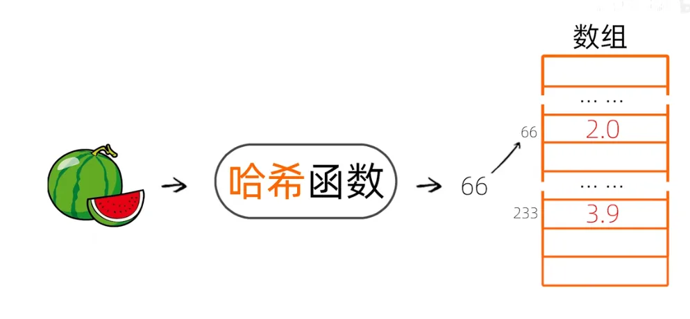
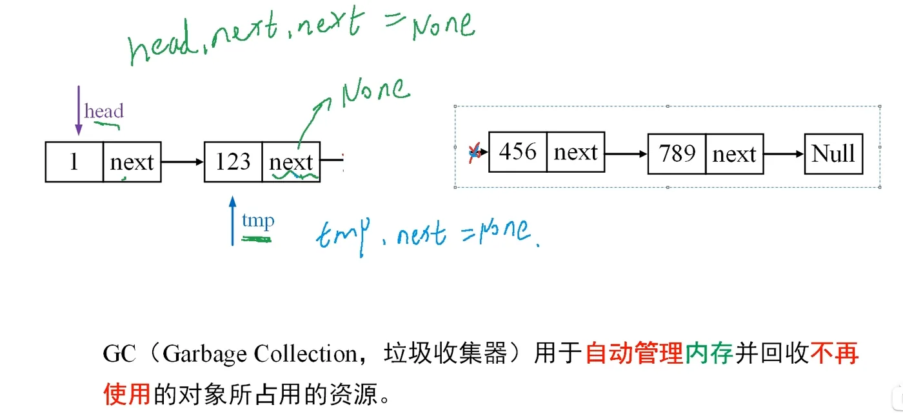
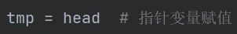

## 哈希表

### 简单理解：

哈希函数：输入数据，生成整数

特点：不同参数 -> 不同整数   ||   同样参数 -> 同样整数

用于实现数据到存储位置的一对一映射，这时候数据的属性放在一张表里面

### Unicode（万国码）

给世界上的每一个字符，甚至表情包，分配一个**唯一码点**

python代码： ord(key)

可以用于哈希的简单实现，平方再取3到6作为数组位置

什么时候会想到用哈希法？用哈希法做映射？
每当要判断这个元素是否出现过，或者判断这个元素是否在这个集合出现过，第一反应哈希，该用哈希什么结构

两数之和为什么要想到哈希法？
因为在遍历元素的时候，能够存放之前遍历过的元素，例如遍历到三了，可以判断一个元素（6）是否之前遍历过，如果之前遍历过就能通过哈希表很快找出来

怎么选择用什么样哈希表来存结构？
两数之和不但需要知道这个元素是否出现过，还需要知道这个元素的下标，此时需要存放两个，这时候想到用字典

## 动态规划  DP

**大事化小，记住答案，拒绝重复劳动**

eg：把算 8 个 1 的问题，转化为“算 7 个 1 的结果 + 1，把中间结果（7）存在脑子里（或者数组里），下次直接用。

经典问题：爬楼梯

思考过程三步走：定义状态（dp 数组是什么？）  ->  找状态转移方程（怎么利用之前的答案？）  ->  确定初始值

**DP 就是填表**：把大问题拆成小问题，把小问题的答案填在表里。

## Python中的基本语法

**==**运算符用于比较两个对象的值是否相等
**is**运算符比较的是两个对象的身份标识，也就是它们在内存中的地址是否相同
总结来说，**==**用于比较值的相等性，而**is**用于比较对象的同一性。

**and**运算符用于布尔“与”运算，如果两个表达式都为真，则结果为真，否则为假
**or**运算符用于布尔“或”运算，如果两个表达式中至少有一个为真，则结果为真，否则为假。
**not**运算符用于布尔“非”运算，它反转表达式的布尔值。
在Python中，除了布尔值True和False外，还有其他一些值被视为False，例如0、空字符串""、空列表[]、空元组()、空字典{}和None。其他所有值都被视为True。

**取模运算符 (%)**：返回两个数相除的余数。
**取整除运算符 (//)**：返回两个数相除后向下取整的结果。

## Python中的字典

python中字典是通过哈希算法实现的（忘记哪看来的）

键不存在的处理方法
**.get()** 方法允许你在键不存在时返回一个默认值，而不会抛出异常。
**.setdefault()** 不仅可以获取值，还会在键不存在时插入该键并设置默认值。
通过*in*关键字可以先判断键是否存在，再决定是否访问。
**使用try...except **通过捕获*KeyError*异常，可以在键不存在时执行特定逻辑。
**defaultdict** 是一个特殊的字典，当访问不存在的键时，会自动返回一个默认值。

## Python中的链表

链表(Linkedlist)是一种常用的数据结构，它由一系列 **节点** 组成，每个节点包含**数据域**和**指针域**。指针域存储了下一个节点的地址，从而建立起各节点之间的线性关系。

python允许用户定义自己的数据类型，即**类**。对象是类的实例
python中节点类型是：用户自己定义的类。

在Python中，类的实例化实际上是创建一个对象，这个对象存储在内存中。当我们调用类的方法时，实际上是在操作这个对象的引用(地址)，因此可以用类来表示链表的结点，即指针域可以赋值:实例化的类。
eg: head.next=Node(1)

断掉的链表会被GC回收

指向同一个链表，操作同一份数据

### 小结：

如何定义链表节点？
通过python中的自定义类，定义值域和指针域
如何操作链表节点？
一般更改的是它的指针域

## 刷题需要注意的

| **维度**     | **以前（苦行僧式）**          | **现在（AI 辅助式）**                                        |
| ------------ | ----------------------------- | ------------------------------------------------------------ |
| **遇到难题** | 死磕 2 小时，想不出来看评论区 | 思考 15 分钟无果，**直接问 AI 要思路提示（Hint）**，而不是直接要代码 |
| **关注点**   | 代码能不能 AC（Passed）       | **多种解法的优劣对比**。问 AI：“为什么这道题用 DFS 比 BFS 好？” |
| **代码实现** | 手写每一行，纠结语法细节      | 搞懂核心逻辑，语法可以让 AI 补全。重点是**你能否看懂 AI 写出的最优解** |
| **复习**     | 重新做一遍                    | 让 AI 给你出变种题，测试你是否真的掌握了**模式（Pattern）**  |

需要学习的重点  **滑动窗口、双指针、二分查找、DFS/BFS、基础动态规划、哈希表**。
